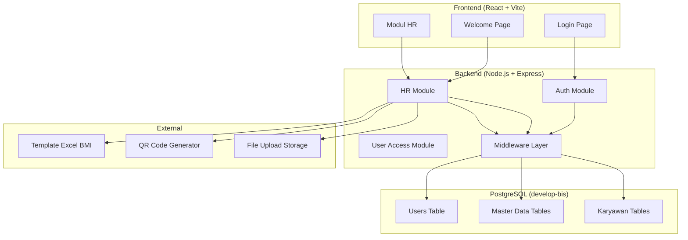
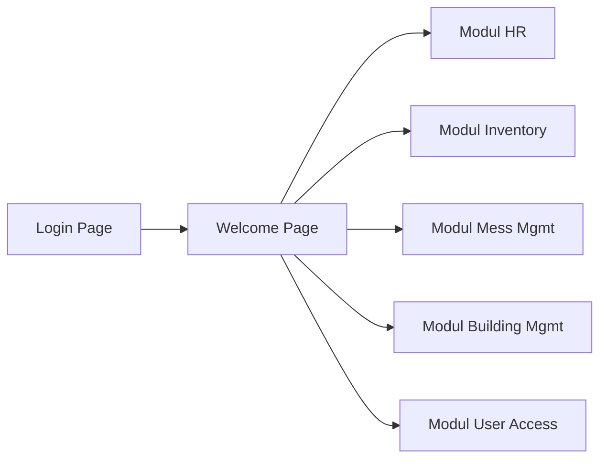

# PRD — Bebang Sistem Informasi (BIS)

**Versi**: 1.0.0
**Tanggal**: 26 Februari 2026
**Nama Database**: `develop-bis`
**Platform**: Progressive Web Application (PWA)
**Bahasa Aplikasi**: Bahasa Indonesia
**Desain**: Trending Web Design 2026

---

## 1. Ringkasan Eksekutif

**Bebang Sistem Informasi (BIS)** adalah aplikasi enterprise web progresif yang dikembangkan untuk PT Prima Sarana Gemilang, site Taliabu. Aplikasi ini berfungsi sebagai **pusat pelayanan data karyawan** yang mendukung lebih dari 500 karyawan aktif. Modul utama pada fase pertama adalah **Human Resources (HR)**, yang mencakup manajemen profil karyawan, master data kepegawaian, serta fitur import/export data massal melalui template Excel (BMI).

### 1.1 Tujuan Utama

- Digitalisasi dan sentralisasi data karyawan PT Prima Sarana Gemilang
- Menyediakan sistem manajemen HR yang komprehensif dan mudah digunakan
- Mendukung import/export data massal melalui template Excel standar (BMI)
- Menyediakan antarmuka yang modern, profesional, dan sesuai standar industri
- Mendukung pembagian hak akses berdasarkan peran pengguna

### 1.2 Target Pengguna

| Peran | Deskripsi | Akses |
|-------|-----------|-------|
| Administrator | Pengelola sistem dan hak akses | Akses penuh ke semua modul |
| HR Staff | Staf departemen SDM | Modul HR (CRUD karyawan, master data) |
| Manager | Kepala departemen/divisi | Melihat data karyawan di bawahnya |
| Karyawan | Seluruh karyawan perusahaan | Melihat profil sendiri (read-only) |

### 1.3 Lingkup Modul

| No | Modul | Status | Keterangan |
|----|-------|--------|------------|
| 1 | **Human Resources** | ✅ Fase 1 | Modul utama, dibangun pertama |
| 2 | Inventory | 🔜 Fase 2 | Manajemen inventaris |
| 3 | Mess Management | 🔜 Fase 2 | Manajemen mess/asrama |
| 4 | Building Management | 🔜 Fase 3 | Manajemen gedung |
| 5 | User Access Right Management | 🔜 Fase 1 | Manajemen hak akses |

---

## 2. Arsitektur Sistem

### 2.1 Stack Teknologi

| Komponen | Teknologi | Versi |
|----------|-----------|-------|
| **Frontend** | React + TypeScript + Vite | Latest |
| **Styling** | Tailwind CSS | v4 |
| **Komponen UI** | shadcn/ui | Latest |
| **Backend** | Node.js + Express/NestJS + TypeScript | Latest |
| **ORM** | Prisma | Latest |
| **Database** | PostgreSQL | 15+ |
| **State Management** | React Query (TanStack Query) | v5 |
| **Routing** | React Router | v6+ |
| **Autentikasi** | JWT (JSON Web Token) | — |
| **File Processing** | xlsx / ExcelJS | Latest |
| **QR Code** | qrcode / react-qr-code | Latest |

### 2.2 Kredensial Database

```
Host     : localhost
Port     : 5432
Database : develop-bis
Username : postgres
Password : 123456789
```

### 2.3 Struktur Folder

```
develop-bis/
├── planning/                    # Dokumen perencanaan
├── backend/
│   ├── prisma/
│   │   ├── schema.prisma        # Skema database
│   │   ├── migrations/          # Migrasi database
│   │   └── seed.ts              # Data seed awal
│   ├── src/
│   │   ├── modules/
│   │   │   ├── auth/            # Modul autentikasi
│   │   │   ├── hr/              # Modul Human Resources
│   │   │   │   ├── controllers/
│   │   │   │   ├── services/
│   │   │   │   ├── dto/
│   │   │   │   └── routes/
│   │   │   └── user-access/     # Modul hak akses
│   │   ├── lib/                 # Library bersama (prisma, utils)
│   │   ├── middlewares/         # Middleware (auth, upload, error)
│   │   └── app.ts               # Entry point
│   ├── uploads/                 # Folder upload file
│   └── package.json
├── frontend/
│   ├── src/
│   │   ├── components/
│   │   │   ├── ui/              # Komponen shadcn/ui
│   │   │   └── shared/          # Komponen bersama
│   │   ├── pages/
│   │   │   ├── auth/            # Halaman login
│   │   │   ├── welcome/         # Halaman welcome
│   │   │   └── hr/              # Halaman modul HR
│   │   ├── hooks/               # Custom hooks
│   │   ├── services/            # API service layer
│   │   ├── types/               # TypeScript types
│   │   ├── lib/                 # Utilitas
│   │   └── App.tsx              # Root component
│   └── package.json
└── develop-bis.code-workspace
```

### 2.4 Diagram Arsitektur



---

## 3. Alur Aplikasi (Application Flow)

### 3.1 Flow Utama



### 3.2 Halaman Login

| Aspek | Detail |
|-------|--------|
| **Username** | Nomor Induk Karyawan (format: `xx-xxxxx`, contoh: `02-03827`) |
| **Password** | Dikelola oleh modul User Access Management |
| **Seed Data** | Password default untuk development menggunakan data seed |
| **Fitur** | Validasi format NIK, pesan error berbahasa Indonesia |

### 3.3 Halaman Welcome

- Menampilkan **shortcut cards** ke setiap modul yang tersedia
- Menampilkan informasi profil singkat pengguna yang login
- Navigasi cepat ke modul-modul yang diizinkan berdasarkan hak akses
- Desain dashboard dengan statistik ringkas (jumlah karyawan aktif, dsb.)

---

## 4. Modul Human Resources — Detail Lengkap

### 4.1 Master Data

Master Data adalah kumpulan data referensi yang digunakan sebagai pilihan (dropdown) di seluruh modul HR. Setiap master data memiliki pola yang konsisten:

> [!IMPORTANT]
> Semua master data memiliki field `status` dengan pilihan **Aktif/Tidak Aktif** (default: Aktif). Hanya data berstatus **Aktif** yang ditampilkan sebagai pilihan di dropdown. Tidak ada data yang dihapus permanen — hanya diubah statusnya.

#### 4.1.1 Divisi

| Field | Tipe | Validasi | Keterangan |
|-------|------|----------|------------|
| `nama_divisi` | Teks | Wajib, Unik | Nama divisi |
| `keterangan` | Teks | Opsional | Deskripsi divisi |
| `status` | Enum | Default: `Aktif` | Aktif / Tidak Aktif |

#### 4.1.2 Department

| Field | Tipe | Validasi | Keterangan |
|-------|------|----------|------------|
| `nama_departmen` | Teks | Wajib, Unik | Nama department |
| `nama_manager` | Relasi | Opsional | Dari data karyawan aktif |
| `divisi` | Relasi | Wajib | Dari master divisi aktif |
| `keterangan` | Teks | Opsional | Deskripsi department |
| `status` | Enum | Default: `Aktif` | Aktif / Tidak Aktif |

#### 4.1.3 Posisi Jabatan

| Field | Tipe | Validasi | Keterangan |
|-------|------|----------|------------|
| `nama_posisi_jabatan` | Teks | Wajib, Unik | Nama posisi |
| `department` | Relasi | Wajib | Dari master department aktif |
| `keterangan` | Teks | Opsional | Deskripsi posisi |
| `status` | Enum | Default: `Aktif` | Aktif / Tidak Aktif |

#### 4.1.4 Kategori Pangkat

| Field | Tipe | Validasi | Keterangan |
|-------|------|----------|------------|
| `nama_kategori_pangkat` | Teks | Wajib, Unik | Nama kategori |
| `keterangan` | Teks | Opsional | Deskripsi |
| `status` | Enum | Default: `Aktif` | Aktif / Tidak Aktif |

#### 4.1.5 Golongan

| Field | Tipe | Validasi | Keterangan |
|-------|------|----------|------------|
| `nama_golongan` | Teks | Wajib, Unik | Nama golongan |
| `keterangan` | Teks | Opsional | Deskripsi |
| `status` | Enum | Default: `Aktif` | Aktif / Tidak Aktif |

#### 4.1.6 Sub Golongan

| Field | Tipe | Validasi | Keterangan |
|-------|------|----------|------------|
| `nama_sub_golongan` | Teks | Wajib, Unik | Nama sub golongan |
| `keterangan` | Teks | Opsional | Deskripsi |
| `status` | Enum | Default: `Aktif` | Aktif / Tidak Aktif |

#### 4.1.7 Jenis Hubungan Kerja

| Field | Tipe | Validasi | Keterangan |
|-------|------|----------|------------|
| `nama_jenis_hubungan_kerja` | Teks | Wajib, Unik | Nama jenis hubungan |
| `keterangan` | Teks | Opsional | Deskripsi |
| `status` | Enum | Default: `Aktif` | Aktif / Tidak Aktif |

#### 4.1.8 Tag

| Field | Tipe | Validasi | Keterangan |
|-------|------|----------|------------|
| `nama_tag` | Teks | Wajib, Unik | Nama tag |
| `warna_tag` | Color | Wajib | Pilihan warna (hex/preset) |
| `keterangan` | Teks | Opsional | Deskripsi |
| `status` | Enum | Default: `Aktif` | Aktif / Tidak Aktif |

#### 4.1.9 Lokasi Kerja

| Field | Tipe | Validasi | Keterangan |
|-------|------|----------|------------|
| `nama_lokasi_kerja` | Teks | Wajib, Unik | Nama lokasi |
| `alamat` | Teks | Opsional | Alamat lengkap |
| `keterangan` | Teks | Opsional | Deskripsi |
| `status` | Enum | Default: `Aktif` | Aktif / Tidak Aktif |

#### 4.1.10 Status Karyawan

| Field | Tipe | Validasi | Keterangan |
|-------|------|----------|------------|
| `nama_status` | Teks | Wajib, Unik | Nama status |
| `keterangan` | Teks | Opsional | Deskripsi |
| `status` | Enum | Default: `Aktif` | Aktif / Tidak Aktif |

