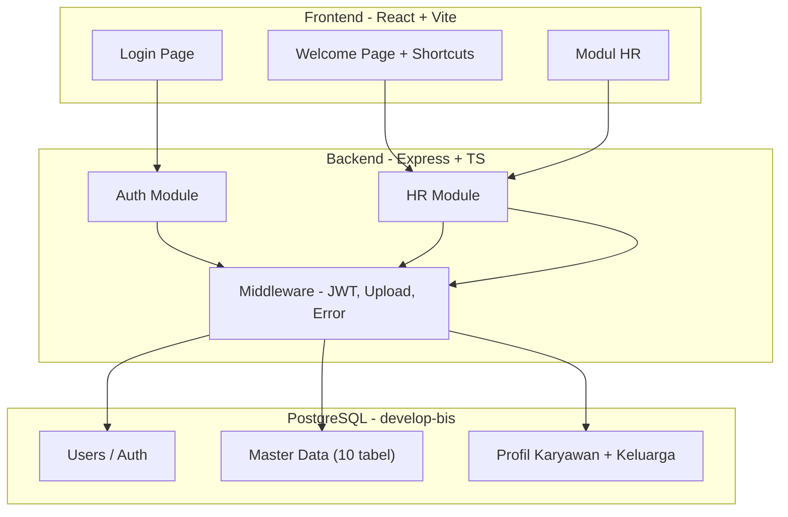
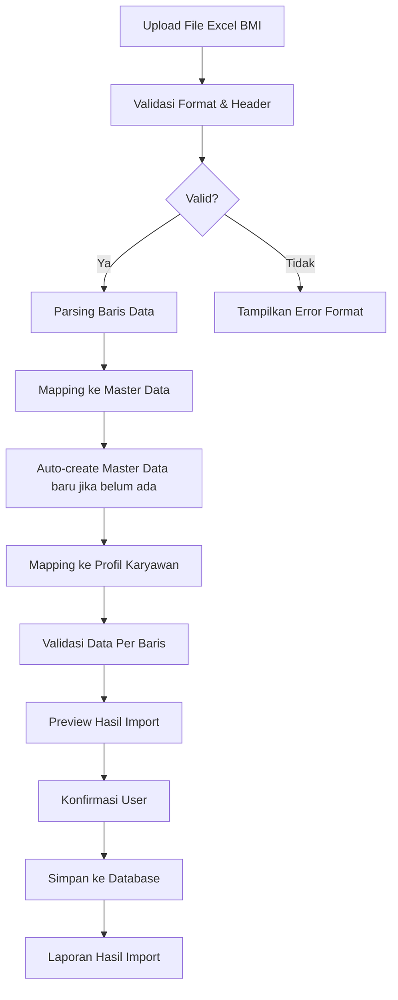
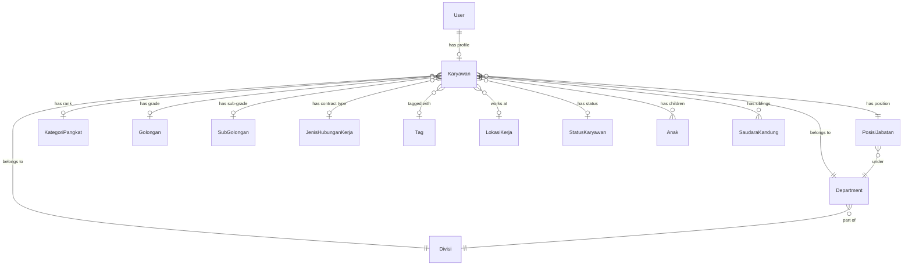
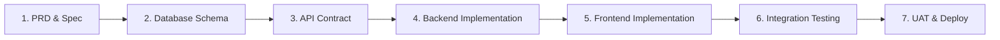

# PRD — Bebang Sistem Informasi (BIS)

**Versi**: 1.0.0 | **Tanggal**: 26 Februari 2026 | **Metodologi**: Spec Driven Development
**Database**: `develop-bis` | **Bahasa**: Indonesia | **Desain**: Trending Web Design 2026

---

## 1. Ringkasan Eksekutif

**Bebang Sistem Informasi (BIS)** adalah aplikasi enterprise web progresif untuk PT Prima Sarana Gemilang, site Taliabu. Aplikasi berfungsi sebagai **pusat pelayanan data karyawan** yang mendukung 500+ karyawan. Fase pertama fokus pada modul **Human Resources** dengan fitur manajemen profil karyawan, master data kepegawaian, dan import/export data massal via template Excel (BMI).

### 1.1 Tujuan

1. Digitalisasi dan sentralisasi data karyawan
2. Sistem manajemen HR komprehensif dengan antarmuka modern
3. Import/export data massal melalui template Excel standar BMI
4. Pembagian hak akses berdasarkan peran pengguna
5. Dukungan QR Code, upload foto, dan dokumen

### 1.2 Target Pengguna

| Peran | Deskripsi | Akses |
|-------|-----------|-------|
| Administrator | Pengelola sistem | Akses penuh semua modul |
| HR Staff | Staf SDM | CRUD karyawan, master data |
| Manager | Kepala dept/divisi | Data karyawan di bawahnya |
| Karyawan | Seluruh karyawan | Profil sendiri (read-only) |

### 1.3 Lingkup Modul

| Modul | Fase | Status |
|-------|------|--------|
| **Human Resources** | 1 | ✅ Prioritas utama |
| **User Access Management** | 1 | ✅ Bersamaan HR |
| Inventory | 2 | 🔜 Direncanakan |
| Mess Management | 2 | 🔜 Direncanakan |
| Building Management | 3 | 🔜 Direncanakan |

---

## 2. Arsitektur Sistem

### 2.1 Stack Teknologi

| Komponen | Teknologi |
|----------|-----------|
| **Frontend** | React + TypeScript + Vite |
| **Styling** | Tailwind CSS v4 |
| **Komponen UI** | shadcn/ui |
| **Backend** | Node.js + Express + TypeScript |
| **ORM** | Prisma |
| **Database** | PostgreSQL (`develop-bis`) |
| **State Mgmt** | TanStack Query v5 |
| **Routing** | React Router v6+ |
| **Auth** | JWT |
| **Excel** | ExcelJS / xlsx |
| **QR Code** | react-qr-code |

### 2.2 Kredensial Database

| Properti | Nilai |
|----------|-------|
| Host | `localhost` |
| Port | `5432` |
| Database | `develop-bis` |
| Username | `postgres` |
| Password | `123456789` |

### 2.3 Struktur Folder

```
develop-bis/
├── planning/              # Dokumen perencanaan & PRD
├── backend/
│   ├── prisma/
│   │   ├── schema.prisma
│   │   ├── migrations/
│   │   └── seed.ts
│   ├── src/
│   │   ├── modules/
│   │   │   ├── auth/      # Autentikasi (login, JWT)
│   │   │   ├── hr/        # Human Resources
│   │   │   │   ├── controllers/
│   │   │   │   ├── services/
│   │   │   │   ├── dto/
│   │   │   │   └── routes/
│   │   │   └── user-access/
│   │   ├── lib/           # Prisma client, utils
│   │   ├── middlewares/   # Auth, upload, error handler
│   │   └── app.ts
│   ├── uploads/
│   └── package.json
├── frontend/
│   ├── src/
│   │   ├── components/
│   │   │   ├── ui/        # shadcn/ui
│   │   │   └── shared/    # Reusable components
│   │   ├── pages/
│   │   │   ├── auth/
│   │   │   ├── welcome/
│   │   │   └── hr/
│   │   ├── hooks/
│   │   ├── services/      # API layer
│   │   ├── types/
│   │   └── App.tsx
│   └── package.json
└── develop-bis.code-workspace
```

### 2.4 Diagram Arsitektur



---

## 3. Alur Aplikasi

### 3.1 Flow Utama

```
Login Page → Welcome Page → Modul (HR / Inventory / Mess / Building / User Access)
```

### 3.2 Login Page

- **Username**: Nomor Induk Karyawan, format `xx-xxxxx` (contoh: `02-03827`)
- **Password**: Dikelola modul User Access Management
- **Dev**: Password default via data seed
- **Validasi**: Format NIK, pesan error bahasa Indonesia
- **Desain**: Modern, glassmorphism, gradient background

### 3.3 Welcome Page

- Shortcut cards ke setiap modul (berdasarkan hak akses)
- Info profil singkat pengguna yang login
- Statistik ringkas (jumlah karyawan aktif, dsb.)

---

## 4. Modul Human Resources

### 4.1 Master Data (10 Entitas — WAJIB)

Setiap master data memiliki operasi **CRUD** penuh, field `status` (Aktif/Tidak Aktif, default: Aktif), dan **soft delete** (tidak ada penghapusan permanen). Hanya data **Aktif** yang muncul di dropdown.

#### 4.1.1 Divisi
| Field | Tipe | Wajib | Keterangan |
|-------|------|-------|------------|
| `nama_divisi` | String | ✅ | Unik |
| `keterangan` | String | — | Deskripsi |
| `status` | Enum | ✅ | Default: Aktif |

#### 4.1.2 Department
| Field | Tipe | Wajib | Keterangan |
|-------|------|-------|------------|
| `nama_departmen` | String | ✅ | Unik |
| `nama_manager` | FK→Karyawan | — | Karyawan aktif, boleh kosong |
| `divisi_id` | FK→Divisi | ✅ | Dari master divisi aktif |
| `keterangan` | String | — | Deskripsi |
| `status` | Enum | ✅ | Default: Aktif |

#### 4.1.3 Posisi Jabatan
| Field | Tipe | Wajib | Keterangan |
|-------|------|-------|------------|
| `nama_posisi_jabatan` | String | ✅ | Unik |
| `department_id` | FK→Dept | ✅ | Dari master department aktif |
| `keterangan` | String | — | Deskripsi |
| `status` | Enum | ✅ | Default: Aktif |

#### 4.1.4 Kategori Pangkat
| Field | Tipe | Wajib | Keterangan |
|-------|------|-------|------------|
| `nama_kategori_pangkat` | String | ✅ | Unik |
| `keterangan` | String | — | |
| `status` | Enum | ✅ | Default: Aktif |

#### 4.1.5 Golongan
| Field | Tipe | Wajib | Keterangan |
|-------|------|-------|------------|
| `nama_golongan` | String | ✅ | Unik |
| `keterangan` | String | — | |
| `status` | Enum | ✅ | Default: Aktif |

#### 4.1.6 Sub Golongan
| Field | Tipe | Wajib | Keterangan |
|-------|------|-------|------------|
| `nama_sub_golongan` | String | ✅ | Unik |
| `keterangan` | String | — | |
| `status` | Enum | ✅ | Default: Aktif |

#### 4.1.7 Jenis Hubungan Kerja
| Field | Tipe | Wajib | Keterangan |
|-------|------|-------|------------|
| `nama_jenis_hubungan_kerja` | String | ✅ | Unik |
| `keterangan` | String | — | |
| `status` | Enum | ✅ | Default: Aktif |

#### 4.1.8 Tag
| Field | Tipe | Wajib | Keterangan |
|-------|------|-------|------------|
| `nama_tag` | String | ✅ | Unik |
| `warna_tag` | String (hex) | ✅ | Warna badge/label |
| `keterangan` | String | — | |
| `status` | Enum | ✅ | Default: Aktif |

#### 4.1.9 Lokasi Kerja
| Field | Tipe | Wajib | Keterangan |
|-------|------|-------|------------|
| `nama_lokasi_kerja` | String | ✅ | Unik |
| `alamat` | String | — | Alamat lengkap |
| `keterangan` | String | — | |
| `status` | Enum | ✅ | Default: Aktif |

#### 4.1.10 Status Karyawan
| Field | Tipe | Wajib | Keterangan |
|-------|------|-------|------------|
| `nama_status` | String | ✅ | Unik |
| `keterangan` | String | — | |
| `status` | Enum | ✅ | Default: Aktif |

#### Mapping Master Data ↔ Template Excel BMI

| Header Excel (BMI) | Field Master Data |
|---------------------|-------------------|
| PANGKAT KATEGORI | `kategori_pangkat.nama_kategori_pangkat` |
| GOLONGAN | `golongan.nama_golongan` |
| SUB GOLONGAN | `sub_golongan.nama_sub_golongan` |
| JENIS HUBUNGAN KERJA | `jenis_hubungan_kerja.nama_jenis_hubungan_kerja` |
| TAG | `tag.nama_tag` |
| LOKASI KERJA | `lokasi_kerja.nama_lokasi_kerja` |
| STATUS KARYAWAN | `status_karyawan.nama_status` |
| DIVISI | `divisi.nama_divisi` |
| DEPARTMENT | `department.nama_departmen` |
| POSISI JABATAN | `posisi_jabatan.nama_posisi_jabatan` |

> Saat import, jika nilai master data belum ada di database, sistem akan membuat record master data baru secara otomatis dengan status Aktif.

---

### 4.2 Profil Karyawan (WAJIB)

Profil karyawan terdiri dari **Bagian Head** (ringkasan di atas) dan **Bagian Detail** (3 tabs). Semua data disimpan di database.

#### 4.2.1 Bagian Head

| Field | Tipe | Wajib | Sumber Dropdown | Kolom Excel BMI |
|-------|------|-------|-----------------|-----------------|
| `foto_karyawan` | File (Gambar) | — | Upload | — |
| `nama_lengkap` | String | ✅ | — | NAMA LENGKAP |
| `nomor_induk_karyawan` | String | ✅ | — | NOMIR INDUK KARYAWAN |
| `divisi` | FK→Divisi | ✅ | Master divisi aktif | DIVISI |
| `department` | FK→Department | ✅ | Master department aktif | DEPARTMENT |
| `manager` | FK→Karyawan | — | Karyawan aktif, posisi "head" | MANAGER |
| `atasan_langsung` | FK→Karyawan | — | Karyawan aktif | ATASAN LANGSUNG |
| `posisi_jabatan` | FK→Posisi | ✅ | Master posisi jabatan aktif | POSISI JABATAN |
| `email_perusahaan` | String (Email) | — | — | EMAIL PERUSAHAAN |
| `nomor_handphone` | String | — | — | NOMOR HP 1 |
| `status_karyawan` | FK→Status | ✅ | Master status karyawan | STATUS KARYAWAN |
| `lokasi_kerja` | FK→Lokasi | ✅ | Master lokasi kerja aktif | LOKASI KERJA |
| `tag` | FK→Tag | — | Master tag aktif | TAG |

> Fitur QR Code: Generate QR Code dari `nomor_induk_karyawan` — ditampilkan di profil dan bisa dicetak.

#### 4.2.2 Tab: Personal Information

**Group: Biodata Karyawan**

| Field | Tipe | Kolom Excel BMI | Catatan |
|-------|------|-----------------|---------|
| `nama_lengkap` | String | NAMA LENGKAP | Referensi dari head |
| `jenis_kelamin` | Enum (L/P) | JENIS KELAMIN | |
| `tempat_lahir` | String | TEMPAT LAHIR | |
| `tanggal_lahir` | Date | TANGGAL LAHIR | |
| `email_pribadi` | String (Email) | EMAIL PRIBADI | |

**Group: Identifikasi**

| Field | Tipe | Kolom Excel BMI | Catatan |
|-------|------|-----------------|---------|
| `agama` | Enum | AGAMA | |
| `golongan_darah` | Enum (A/B/AB/O) | GOLOGAN DARAH | |
| `nomor_kartu_keluarga` | String | NOMOR KARTU KELUARGA | |
| `nomor_ktp` | String | NOMOR KTP | |
| `nomor_npwp` | String | NOMOR NPWP | |
| `nomor_bpjs` | String | NOMOR BPJS-TK | |
| `no_nik_kk` | String | NOMOR NIK KK | |
| `status_pajak` | String | STATUS PAJAK | |

**Group: Alamat Domisili**

| Field | Tipe | Kolom Excel BMI |
|-------|------|-----------------|
| `alamat_domisili` | Text Area | ALAMAT DOMISILI |
| `kota_domisili` | String | KOTA DOMISILI |
| `provinsi_domisili` | String | PROPINSI DOMISILI |

**Group: Alamat KTP**

| Field | Tipe | Kolom Excel BMI |
|-------|------|-----------------|
| `alamat_ktp` | Text Area | ALAMAT KTP |
| `kota_ktp` | String | — |
| `provinsi_ktp` | String | — |

**Group: Informasi Kontak**

| Field | Tipe | Kolom Excel BMI | Catatan |
|-------|------|-----------------|---------|
| `nomor_handphone_1` | String | NOMOR HP 1 | Referensi dari head |
| `nomor_handphone_2` | String | NOMOR JP 2 | |
| `nomor_telepon_rumah_1` | String | NOMOR TELEPON RUMAH 1 | |
| `nomor_telepon_rumah_2` | String | NOMOR TELEPON RUMAJ 2 | |

**Group: Status Pernikahan dan Anak**

| Field | Tipe | Kolom Excel BMI |
|-------|------|-----------------|
| `status_pernikahan` | Enum | STATUS PERNIKAHAN |
| `nama_pasangan` | String | NAMA PASANGAN NIKAH |
| `tanggal_menikah` | Date | TANGGAL MENIKAH |
| `tanggal_cerai` | Date | TANGGAL CERAI |
| `tanggal_wafat_pasangan` | Date | TANGGAL WAFAT PASANGAN |
| `pekerjaan_pasangan` | String | PEKERJAAN PASANGAN |
| `jumlah_anak` | Integer | JUMLAH ANAK |

**Group: Rekening Bank**

| Field | Tipe | Kolom Excel BMI |
|-------|------|-----------------|
| `nomor_rekening` | String | NOMOR REKENING |
| `nama_pemegang_rekening` | String | NAMA PEMILIK REKENING |
| `nama_bank` | String | NAMA BANK |
| `cabang_bank` | String | CABANG BANK |

#### 4.2.3 Tab: Informasi HR

**Group: Kepegawaian**

| Field | Tipe | Kolom Excel BMI | Catatan |
|-------|------|-----------------|---------|
| `nomor_induk_karyawan` | String | NOMIR INDUK KARYAWAN | Ref dari head |
| `posisi_jabatan` | FK→Posisi | POSISI JABATAN | Ref dari head |
| `divisi` | FK→Divisi | DIVISI | Ref dari head |
| `department` | FK→Dept | DEPARTMENT | Ref dari head |
| `email_perusahaan` | String | EMAIL PERUSAHAAN | Ref dari head |
| `manager` | FK→Karyawan | MANAGER | Ref dari head |
| `atasan_langsung` | FK→Karyawan | ATASAN LANGSUNG | Ref dari head |

**Group: Kontrak**

| Field | Tipe | Kolom Excel BMI |
|-------|------|-----------------|
| `jenis_hubungan_kerja` | FK→JenisHK | JENIS HUBUNGAN KERJA |
| `tanggal_masuk_group` | Date | TANGGAL JOIN GROUP |
| `tanggal_masuk` | Date | TANGGAL MASUK |
| `tanggal_permanent` | Date | TANGGAL TETAP |
| `tanggal_kontrak` | Date | TANGGAL AWAL KONTRAK |
| `tanggal_akhir_kontrak` | Date | TANGGAL AKHIR KONTRAK |
| `tanggal_berhenti` | Date | TANGGAL KELUAR |

**Group: Pendidikan**

| Field | Tipe | Kolom Excel BMI |
|-------|------|-----------------|
| `tingkat_pendidikan` | String | PENDIDIKAN TERAKHIR |
| `bidang_studi` | String | JURUSAN PENDIDIKAN |
| `nama_sekolah` | String | NAMA SEKOLAH |
| `kota_sekolah` | String | KOTA SEKOLAH |
| `status_kelulusan` | Enum | STATUS PENDIDIKAN |
| `keterangan` | Text Area | KETERANGAN PENDIDIKAN |

**Group: Pangkat dan Golongan**

| Field | Tipe | Kolom Excel BMI |
|-------|------|-----------------|
| `kategori_pangkat` | FK→KatPangkat | PANGKAT KATEGORI |
| `golongan_pangkat` | FK→Golongan | GOLONGAN |
| `sub_golongan_pangkat` | FK→SubGol | SUB GOLONGAN |
| `no_dana_pensiun` | String | NOMOR DANA PENSIUN |

**Group: Kontak Darurat**

| Field | Tipe | Kolom Excel BMI |
|-------|------|-----------------|
| `nama_kontak_darurat_1` | String | NAMA KONTAK DARURAT 1 |
| `nomor_telepon_kontak_darurat_1` | String | NOMOR HP1 KONTAK DARURAT 1 |
| `hubungan_kontak_darurat_1` | String | HUNGAN KONTRAK DARURAT 1 |
| `alamat_kontak_darurat_1` | Text Area | ALAMAT KONTAK DARURAT 1 |
| `nama_kontak_darurat_2` | String | — |
| `nomor_telepon_kontak_darurat_2` | String | NOMOR HP2 KONTAK DARURAT 1 |
| `hubungan_kontak_darurat_2` | String | — |
| `alamat_kontak_darurat_2` | Text Area | — |

**Group: POO/POH**

| Field | Tipe | Kolom Excel BMI |
|-------|------|-----------------|
| `point_of_original` | String | POINT OF ORIGINAL |
| `point_of_hire` | String | POINT OF HIRE |

**Group: Seragam dan Sepatu Kerja**

| Field | Tipe | Kolom Excel BMI |
|-------|------|-----------------|
| `ukuran_seragam_kerja` | String | UKURAN BAJU |
| `ukuran_sepatu_kerja` | String | UKURAN SEPATU |

**Group: Pergerakan Karyawan**

| Field | Tipe | Kolom Excel BMI |
|-------|------|-----------------|
| `lokasi_sebelumnya` | FK→Lokasi | LOKASI SEBELUMNYA |
| `tanggal_mutasi` | Date | TANGGAL MUTASI |

**Group: Costing**

| Field | Tipe | Kolom Excel BMI |
|-------|------|-----------------|
| `siklus_pembayaran_gaji` | String | SIKLUS PEMBAYARAN |
| `costing` | String | LOKASI COSTING |
| `assign` | String | ASSIGN |
| `actual` | String | ACTUAL |

#### 4.2.4 Tab: Informasi Keluarga

**Group: Pasangan dan Anak**

| Field | Tipe | Kolom Excel BMI | Catatan |
|-------|------|-----------------|---------|
| `nama_pasangan` | String | NAMA PASANGAN NIKAH | Ref dari Personal Info |
| `tanggal_lahir_pasangan` | Date | TANGGAL LAHIR PASANGAN | |
| `pendidikan_terakhir_pasangan` | String | PENDIDIKAN TERAKHIR PASANGAN | |
| `pekerjaan_pasangan` | String | PEKERJAAN PASANGAN | |
| `jumlah_anak` | Integer | JUMLAH ANAK | Ref dari Personal Info |
| `keterangan_pasangan` | Text Area | KETERANGAN PASANGAN | |

**Group: Identitas Anak** (Repeatable, berdasarkan `jumlah_anak`, maks. 4)

| Field | Tipe | Kolom Excel BMI |
|-------|------|-----------------|
| `nama_anak_{n}` | String | NAMA ANAK {n} |
| `jenis_kelamin_anak_{n}` | Enum | JENIS KELAMIN ANAK {n} |
| `tanggal_lahir_anak_{n}` | Date | TANGGAL LAHIR ANAK {n} |
| `keterangan_anak_{n}` | Text Area | KETERANGAN ANAK {n} |

> `{n}` = 1 sampai 4. Kolom ditampilkan dinamis berdasarkan `jumlah_anak`.

**Group: Orang Tua Kandung**

| Field | Tipe | Kolom Excel BMI |
|-------|------|-----------------|
| `nama_ayah_kandung` | String | NAMA BAPAK KANDUNG |
| `tanggal_lahir_ayah_kandung` | Date | TANGGAL LAHUR BAPAK KANDUNG |
| `pendidikan_terakhir_ayah` | String | PENDIDIKAN TERAKHIR BAPAK KANDUNG |
| `pekerjaan_ayah` | String | PEKERJAAN BAPAK KANDUNG |
| `keterangan_ayah` | Text Area | KETERANGAN BAPAK KANDUNG |
| `nama_ibu_kandung` | String | NAMA IBU KANDUNG |
| `tanggal_lahir_ibu_kandung` | Date | TANGGAL LAHIR IBU KANDUNG |
| `pendidikan_terakhir_ibu` | String | PENDIDIKAN TERAKHIR IBU KANDUNG |
| `pekerjaan_ibu` | String | PEKERJAAN IBU KANDUNG |
| `keterangan_ibu` | Text Area | KETERANGAN IBU KANDUNG |

**Group: Saudara Kandung** (Repeatable, maks. 5)

| Field | Tipe | Kolom Excel BMI |
|-------|------|-----------------|
| `anak_ke` | Integer | — |
| `jumlah_saudara_kandung` | Integer | — |
| `nama_saudara_kandung_{n}` | String | NAMA SAUDARA KANDUNG {n} |
| `jenis_kelamin_saudara_{n}` | Enum | JENIS KELELAMIN SAUDARA KANDUNG {n} |
| `tanggal_lahir_saudara_{n}` | Date | TANGGAL LAHUR SAUDARA KANDUNG {n} |
| `pendidikan_terakhir_saudara_{n}` | String | PENDIDIKAN TERAKHIR SAUDARA KANDUNG {n} |
| `pekerjaan_saudara_{n}` | String | PEKERJAAN SAUDARA KANDUNG {n} |
| `keterangan_saudara_{n}` | Text Area | KETERANGAN SAUDARA KANDUNG {n} |

> `{n}` = 1 sampai 5 (dalam Excel: 1 sampai 4, ditambah duplikat kolom 3).

**Group: Orang Tua Mertua**

| Field | Tipe | Kolom Excel BMI |
|-------|------|-----------------|
| `nama_ayah_mertua` | String | NAMA BAPAK MERTUA |
| `tanggal_lahir_ayah_mertua` | Date | TANGGAL LAHUR BAPAK MERTUA |
| `pendidikan_terakhir_ayah_mertua` | String | PENDIDKAN TERAKHIR BAPAK MERTUA |
| `pekerjaan_ayah_mertua` | String | PEKERJAAN BAPAK MERTUA |
| `keterangan_ayah_mertua` | Text Area | KETERANGAN BAPAK MERTUA |
| `nama_ibu_mertua` | String | NAMA IBU MERTUA |
| `tanggal_lahir_ibu_mertua` | Date | TANGGAL LAHIR IBU MERTUA |
| `pendidikan_terakhir_ibu_mertua` | String | PENDIDIKAN TERAKHIR IBU MERTUA |
| `pekerjaan_ibu_mertua` | String | PEKERJAAN IBU MERTUA |
| `keterangan_ibu_mertua` | Text Area | KETERANGAN IBU MERTUA |

---

### 4.3 Import / Export Data (Template Excel BMI)

#### 4.3.1 Template BMI-kosong.xlsx

Template Excel berisi **4 sheet**:

| Sheet | Fungsi | Keterangan |
|-------|--------|------------|
| `Masterdata` | Data utama karyawan | 148 kolom, digunakan untuk import/export |
| `header excel` | Daftar header | 147 header kolom Excel |
| `header excel vs master data` | Mapping master data | 10 kolom → 10 entitas master data |
| `header excel vs profil karyawan` | Mapping profil | 147 kolom → field profil karyawan |

#### 4.3.2 Fitur Import



**Spesifikasi Import:**

| Aspek | Detail |
|-------|--------|
| Format File | `.xlsx` (template BMI) |
| Sheet Data | `Masterdata` |
| Validasi Header | Wajib sesuai template BMI |
| Baris Pertama | Header (skip), data mulai baris 2 |
| Duplicate Check | Berdasarkan `nomor_induk_karyawan` |
| Mode Duplikat | **Update** data yang sudah ada, **Create** data baru |
| Master Data | Auto-create jika belum ada, mapping berdasarkan nama |
| Preview | Tampilkan preview sebelum simpan, highlight error/warning |
| Batch Size | Mendukung batch processing untuk 500+ karyawan |
| Error Handling | Per-baris, tidak menghentikan seluruh proses |
| Laporan | Jumlah berhasil, gagal, dan di-skip |

#### 4.3.3 Fitur Export

| Aspek | Detail |
|-------|--------|
| Format Output | `.xlsx` sesuai template BMI |
| Sheet | `Masterdata` (terisi data karyawan) |
| Filter | Berdasarkan divisi, department, status, lokasi kerja |
| Kolom | Sesuai 148 kolom template BMI |
| Nama File | `BMI-export-{tanggal}-{filter}.xlsx` |

---

## 5. Desain UI/UX — Trending Web Design 2026

### 5.1 Prinsip Desain

| Prinsip | Implementasi |
|---------|--------------|
| **Glassmorphism 2.0** | Card transparan dengan blur, border halus, shadow multi-layer |
| **Bento Grid Layout** | Dashboard dan welcome page menggunakan grid asimetris |
| **Micro-interactions** | Animasi hover, transisi halaman, loading skeleton |
| **Dark Mode First** | Tema gelap sebagai default, toggle ke light mode |
| **Fluid Typography** | Ukuran font responsif menggunakan `clamp()` |
| **3D Depth** | Elemen mengambang dengan shadow bertingkat |
| **Gradient Mesh** | Background gradient multi-warna yang halus |
| **Neobrutalism Accent** | Aksen border tebal dan shadow pada elemen CTA |

### 5.2 Palet Warna

| Elemen | Dark Mode | Light Mode |
|--------|-----------|------------|
| Background | `#0a0a0f` → `#1a1a2e` | `#f8f9fc` → `#ffffff` |
| Surface/Card | `rgba(255,255,255,0.05)` | `rgba(0,0,0,0.02)` |
| Primary | `#6366f1` (Indigo 500) | `#4f46e5` (Indigo 600) |
| Secondary | `#8b5cf6` (Violet 500) | `#7c3aed` (Violet 600) |
| Accent | `#06b6d4` (Cyan 500) | `#0891b2` (Cyan 600) |
| Success | `#10b981` | `#059669` |
| Warning | `#f59e0b` | `#d97706` |
| Error | `#ef4444` | `#dc2626` |
| Text Primary | `#f1f5f9` | `#1e293b` |
| Text Secondary | `#94a3b8` | `#64748b` |
| Border | `rgba(255,255,255,0.1)` | `rgba(0,0,0,0.08)` |

### 5.3 Typography

| Elemen | Font | Weight | Size |
|--------|------|--------|------|
| Heading H1 | Inter | 700 | `clamp(1.875rem, 3vw, 2.5rem)` |
| Heading H2 | Inter | 600 | `clamp(1.5rem, 2.5vw, 2rem)` |
| Heading H3 | Inter | 600 | `clamp(1.25rem, 2vw, 1.5rem)` |
| Body | Inter | 400 | `0.875rem – 1rem` |
| Caption | Inter | 400 | `0.75rem` |
| Mono/Code | JetBrains Mono | 400 | `0.875rem` |

### 5.4 Komponen UI Utama

| Komponen | Styling |
|----------|---------|
| **Sidebar** | Collapsible, glassmorphism, ikon animasi, badge notifikasi |
| **Data Table** | Sticky header, zebra stripe subtle, sorting, pagination, bulk select |
| **Form** | Floating label, inline validation, auto-save indicator |
| **Modal/Dialog** | Backdrop blur, slide-in animation, responsive sizing |
| **Cards** | Gradient border, hover lift effect, skeleton loading |
| **Buttons** | Gradient fill, ripple effect, loading spinner |
| **Tabs** | Animated underline indicator, badge counter |
| **Toast/Notif** | Slide dari kanan, auto-dismiss, progress bar |
| **Search** | Command palette (Ctrl+K), fuzzy search, recent searches |
| **Dropdown** | Searchable, virtualized list untuk data besar |

### 5.5 Layout Halaman

**Login Page:**
- Split layout: kiri = branding/ilustrasi animasi, kanan = form login
- Gradient mesh background, glassmorphism card
- Input floating label, validasi real-time

**Welcome Page:**
- Bento grid dengan shortcut cards dan statistik
- Greeting dinamis berdasarkan waktu
- Quick stats: total karyawan, karyawan baru bulan ini, dsb.

**HR Module:**
- Sidebar navigasi (master data, karyawan, import/export)
- Content area dengan breadcrumb
- Master data: tabel dengan inline edit, search, filter status
- Profil karyawan: header card + tabbed detail

---

## 6. Skema Database (Prisma)

### 6.1 Entity Relationship Diagram



### 6.2 Tabel Utama

| Tabel | Deskripsi | Relasi |
|-------|-----------|--------|
| `users` | Akun login (NIK, password hash, role) | 1:1 → karyawan |
| `karyawan` | Profil lengkap karyawan (semua field) | FK ke semua master |
| `divisi` | Master divisi | 1:N → department |
| `department` | Master department | FK → divisi, 1:N → posisi |
| `posisi_jabatan` | Master posisi | FK → department |
| `kategori_pangkat` | Master pangkat | — |
| `golongan` | Master golongan | — |
| `sub_golongan` | Master sub golongan | — |
| `jenis_hubungan_kerja` | Master jenis HK | — |
| `tag` | Master tag | — |
| `lokasi_kerja` | Master lokasi | — |
| `status_karyawan` | Master status | — |
| `anak` | Data anak karyawan | FK → karyawan |
| `saudara_kandung` | Data saudara karyawan | FK → karyawan |

> Semua tabel memiliki field: `id` (UUID), `created_at`, `updated_at`. Master data memiliki tambahan `status` (enum).

---

## 7. API Specification

### 7.1 Autentikasi

| Method | Endpoint | Deskripsi |
|--------|----------|-----------|
| POST | `/api/auth/login` | Login dengan NIK + password |
| POST | `/api/auth/logout` | Logout & invalidate token |
| GET | `/api/auth/me` | Profil user yang login |

### 7.2 Master Data (berlaku untuk semua 10 entitas)

Pattern: `/api/hr/{entity}` dimana `{entity}` = `divisi`, `department`, `posisi-jabatan`, `kategori-pangkat`, `golongan`, `sub-golongan`, `jenis-hubungan-kerja`, `tag`, `lokasi-kerja`, `status-karyawan`

| Method | Endpoint | Deskripsi |
|--------|----------|-----------|
| GET | `/api/hr/{entity}` | List semua (filter: status, search, pagination) |
| GET | `/api/hr/{entity}/:id` | Detail by ID |
| POST | `/api/hr/{entity}` | Buat baru |
| PUT | `/api/hr/{entity}/:id` | Update |
| PATCH | `/api/hr/{entity}/:id/status` | Toggle status Aktif/Tidak Aktif |

### 7.3 Karyawan

| Method | Endpoint | Deskripsi |
|--------|----------|-----------|
| GET | `/api/hr/karyawan` | List (filter, search, pagination) |
| GET | `/api/hr/karyawan/:id` | Detail profil lengkap (incl. keluarga) |
| POST | `/api/hr/karyawan` | Buat profil baru |
| PUT | `/api/hr/karyawan/:id` | Update profil |
| POST | `/api/hr/karyawan/:id/foto` | Upload foto karyawan |
| GET | `/api/hr/karyawan/:id/qr` | Generate QR Code dari NIK |

### 7.4 Import / Export

| Method | Endpoint | Deskripsi |
|--------|----------|-----------|
| GET | `/api/hr/import/template` | Download template BMI kosong |
| POST | `/api/hr/import/preview` | Upload & preview hasil import |
| POST | `/api/hr/import/execute` | Eksekusi import ke database |
| GET | `/api/hr/export` | Export data karyawan ke Excel BMI |

---

## 8. Ketentuan Umum

### 8.1 Aturan Pengembangan

| No | Ketentuan |
|----|-----------|
| 1 | Aplikasi menggunakan **Bahasa Indonesia** sepenuhnya |
| 2 | **Tidak ada data mock, statis, atau hardcoded** |
| 3 | Data awal menggunakan **seed** untuk development |
| 4 | Folder backend dan frontend **terpisah** |
| 5 | Modul dipisahkan **per folder** |
| 6 | UI **profesional, bersih, dan modern** |
| 7 | Mendukung **QR Code, Upload Foto & Dokumen** |
| 8 | **Dropdown dengan fitur search** untuk field pilihan |
| 9 | Semua field profil karyawan **disimpan di database** |
| 10 | Aplikasi bebas **lint error dan script error** |

### 8.2 Metodologi: Spec Driven Development



| Fase | Output | Keterangan |
|------|--------|------------|
| 1. PRD & Spec | Dokumen ini (PRD.md) | Spesifikasi lengkap sebagai sumber kebenaran |
| 2. Database Schema | `schema.prisma` | Dibangun dari PRD, lalu migrate |
| 3. API Contract | Endpoint spec | Sesuai section 7 dokumen ini |
| 4. Backend | Controller, Service, Route | Implementasi sesuai spec API |
| 5. Frontend | Pages, Components | Implementasi sesuai spec desain |
| 6. Testing | Integration test | API dan UI test |
| 7. Deploy | Production build | Server lokal, potensi scale cloud |

### 8.3 Data Seed Awal

| Data | Detail |
|------|--------|
| Admin User | NIK: `01-00001`, Password: `admin123`, Role: Administrator |
| Master Divisi | Minimal 3 divisi contoh |
| Master Department | Minimal 3 department contoh |
| Master Posisi | Minimal 5 posisi contoh |
| Master Lokasi | Minimal 2 lokasi contoh (incl. Taliabu) |
| Karyawan | Minimal 5 karyawan contoh |

---

## 9. Non-Functional Requirements

| Aspek | Requirement |
|-------|-------------|
| **Performa** | Response time < 2s untuk operasi CRUD, < 5s untuk import 500 row |
| **Skalabilitas** | Mendukung 500+ karyawan aktif secara bersamaan |
| **Keamanan** | JWT auth, password hashing (bcrypt), role-based access |
| **Responsif** | Desktop-first, mendukung tablet (resolusi 768px+) |
| **Browser** | Chrome, Edge, Firefox (versi terbaru) |
| **Instalasi** | Server lokal, potensi migrasi ke cloud |
| **Backup** | Database backup via pg_dump (manual/scheduled) |
| **Bahasa** | Seluruh UI, pesan error, dan label dalam Bahasa Indonesia |

---

## 10. Lampiran

### 10.1 Daftar Lengkap 148 Kolom Template Excel BMI

Kolom pada sheet `Masterdata` file `BMI-kosong.xlsx`:

| No | Header Excel | Field Database |
|----|-------------|----------------|
| 1 | NOMIR INDUK KARYAWAN | `nomor_induk_karyawan` |
| 2 | NAMA LENGKAP | `nama_lengkap` |
| 3 | POSISI JABATAN | `posisi_jabatan` |
| 4 | LOKASI COSTING | `costing` |
| 5 | ACTUAL | `actual` |
| 6 | ASSIGN | `assign` |
| 7 | PANGKAT KATEGORI | `kategori_pangkat` (→master) |
| 8 | GOLONGAN | `golongan_pangkat` (→master) |
| 9 | SUB GOLONGAN | `sub_golongan_pangkat` (→master) |
| 10 | TEMPAT LAHIR | `tempat_lahir` |
| 11 | TANGGAL LAHIR | `tanggal_lahir` |
| 12 | TANGGAL JOIN GROUP | `tanggal_masuk_group` |
| 13 | TANGGAL MASUK | `tanggal_masuk` |
| 14 | JENIS HUBUNGAN KERJA | `jenis_hubungan_kerja` (→master) |
| 15–18 | TANGGAL KONTRAK/TETAP/KELUAR | `tanggal_kontrak/permanent/berhenti` |
| 19 | JENIS KELAMIN | `jenis_kelamin` |
| 20 | AGAMA | `agama` |
| 21–23 | ALAMAT/KOTA/PROPINSI DOMISILI | `alamat/kota/provinsi_domisili` |
| 24–27 | NOMOR TELEPON/HP | `nomor_telepon_rumah/handphone` |
| 28 | GOLOGAN DARAH | `golongan_darah` |
| 29–33 | NOMOR KTP/NPWP/BPJS/DANA PENSIUN | Identifikasi |
| 34–35 | NOMOR REKENING/NAMA PEMILIK | Rekening bank |
| 36–38 | STATUS PERKAWINAN/ANAK/PAJAK | Status |
| 39–45 | PENDIDIKAN | `tingkat_pendidikan` etc. |
| 46–54 | STATUS PERNIKAHAN & PASANGAN | Pernikahan detail |
| 55–70 | ANAK 1–4 | Data anak (4×4 kolom) |
| 71–80 | ORANG TUA KANDUNG | Bapak + Ibu (5+5 kolom) |
| 81–110 | SAUDARA KANDUNG 1–5 | 5 saudara (6 kolom each) |
| 111 | SIKLUS PEMBAYARAN | `siklus_pembayaran_gaji` |
| 112–113 | NAMA/CABANG BANK | `nama_bank/cabang_bank` |
| 114–123 | MERTUA | Bapak + Ibu mertua (5+5 kolom) |
| 124–126 | SUB DEPT/DEPARTMENT/DIVISI | Organisasi |
| 127–131 | KONTAK DARURAT | 5 field kontak darurat |
| 132–133 | UKURAN SEPATU/BAJU | Seragam kerja |
| 134–136 | LOKASI SEBELUMNYA/MUTASI/UNIT | Pergerakan |
| 137–138 | POINT OF ORIGINAL/HIRE | POO/POH |
| 139–140 | NOMOR KK/NIK KK | Identifikasi KK |
| 141 | LOKASI KERJA | `lokasi_kerja` (→master) |
| 142 | STATUS KARYAWAN | `status_karyawan` (→master) |
| 143 | TAG | `tag` (→master) |
| 144 | MANAGER | `manager` (→karyawan) |
| 145 | ATASAN LANGSUNG | `atasan_langsung` (→karyawan) |
| 146 | EMAIL PERUSAHAAN | `email_perusahaan` |
| 147 | EMAIL PRIBADI | `email_pribadi` |

### 10.2 Catatan Khusus Mapping Excel

> [!IMPORTANT]
> Beberapa field pada profil karyawan mereferensikan **kolom yang sama** pada Excel. Contoh: `nama_lengkap` di Head dan di Tab Personal Information keduanya merujuk pada kolom `NAMA LENGKAP`. Ini berarti satu kolom Excel bisa memetakan ke beberapa lokasi tampilan di UI, namun di database disimpan **satu kali** saja.

> [!NOTE]
> Kolom `ORGANISSASI SUB DEPARTMENT` (No. 124) dan `UNIT YANG DI BAWAH` (No. 136) belum memiliki mapping langsung ke profil karyawan pada spesifikasi saat ini. Field ini perlu didiskusikan untuk implementasi selanjutnya.

---

*Dokumen ini adalah sumber kebenaran (single source of truth) untuk pengembangan aplikasi Bebang Sistem Informasi menggunakan metodologi Spec Driven Development. Seluruh implementasi harus mengacu pada dokumen ini.*

